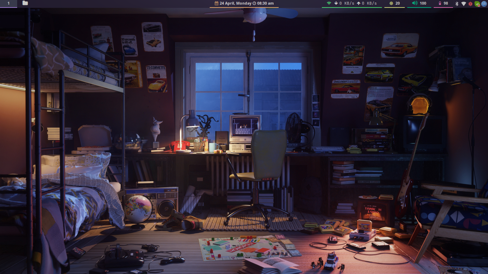
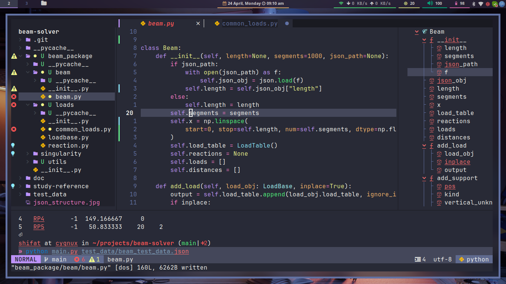
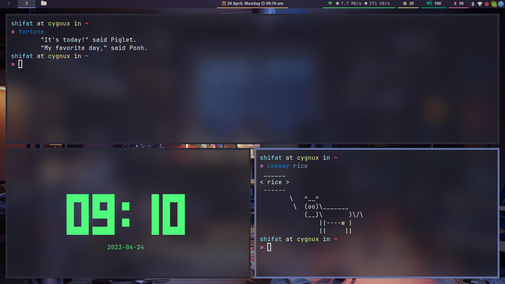

# My Precious Rice!

Work is on progress. I will update when it's a bit presentable.

### Here's what I am using:

- Window Manager: i3-gaps
- File Browser: ranger
- Compositor: youshi/picom
- Status Bar: bumblebee-status, polybar (*current*)
- Terminal: alacritty
- Misc: rofi
- Font: JetBrainsMono Nerd Font
- Theme/Colorscheme: Dracula

### Sample Screen Shots
Here's what I have so far...

#### Home Screen

#### Neovim

#### A sample workspace

